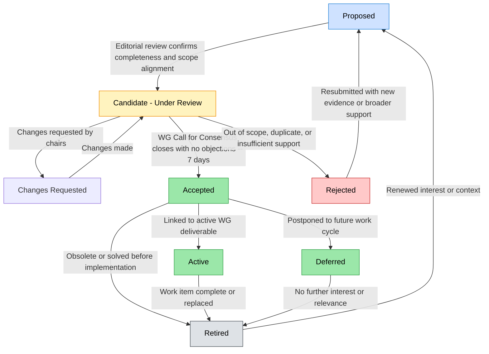

# Trusted AI Agents WG – Use Case Governance Process

## 1\. Purpose & Scope

This document defines how the **Trusted AI Agents Working Group (TAA-WG)** governs use cases throughout their lifecycle, from initial proposal to retirement. It ensures transparency, accountability, and continuity between use cases, work items, and downstream deliverables (e.g., specifications, governance patterns, or policy frameworks).

A governed use case is one that:
- Has been formally reviewed by the WG,  
- Meets agreed-upon acceptance criteria, and  
- Is traceable to the WG’s chartered objectives.

## 2\. Definitions & Roles
### Definitions

| Term | Definition |
| :---- | :---- |
| **Use Case** | A concise narrative describing a real-world problem or opportunity relevant to agentic trust, identity, and governance. All use cases are submitted through the Use Case Template as a Github Issue.  |
| **Proposed** | A newly submitted use case pending initial review. |
| **Candidate** | A proposed use case under WG consideration for acceptance. |
| **Accepted** | A use case officially recognized by the WG as within scope and valuable. |
| **Active** | An accepted use case currently being pursued or informing an active work item. |
| **Deferred** | A use case judged valuable but postponed for later cycles. |
| **Rejected** | A use case deemed out-of-scope, duplicate, or otherwise not accepted. |
| **Retired** | A use case previously active or accepted that has become obsolete, completed, or superseded. |

### Roles

| Role | Responsibility |
| :---- | :---- |
| **Submitter(s)** | Anyone proposing a new use case following the required template. |
| **Shepherd/Editor** | The individual responsible for maintaining the canonical version of a use case, responding to WG feedback, and linking to work items. |
| **WG Chairs** | Oversee review cycles, facilitate consensus, and record official acceptance or rejection. |
| **WG Members** | Provide comments, raise objections, and participate in consensus calls. |
| **Review Panel (optional)** | A small, ad-hoc group of subject-matter experts invited to review complex or cross-WG cases. |

## 3\. Lifecycle

The lifecycle describes all states a use case can pass through, and how it transitions between them.

Each transition has a defined trigger and authority (who approves it).

### Lifecycle Overview

| State | Description | Entry Criteria | Exit Criteria |
| :---- | :---- | :---- | :---- |
| **Proposed** | A new use case has been submitted using the WG template. | Submission received; Shepherd assigned. | Completeness and scope verified. |
| **Candidate (Under Review)** | The use case is under active WG discussion. | Editorial review passed. | Accepted, Rejected, or Deferred after CfC. |
| **Accepted** | WG consensus affirms that the use case is valuable and in scope. | CfC passes with no unresolved objections. | May transition to Active, Deferred, or Retired. |
| **Changes Requested** | Changes requested to proposal | May transition to Candidate after changes proposed |
| **Active** | The use case is informing or driving a current deliverable. | Linked to at least one live work item. | Retired when completed or replaced. |
| **Deferred** | The WG agrees the use case has merit but not immediate priority. | Consensus to postpone. | Retired if no follow-up within next review cycle. |
| **Rejected** | WG consensus that the use case is out of scope, duplicate, or not supported. | Consensus or objection resolution. | Can be resubmitted as new Proposed if substantially revised. |
| **Retired** | The use case has been completed, superseded, or deemed obsolete. | Work item closure or lack of ongoing interest. | May be reopened with new evidence or relevance. |

## Transition Triggers

| From → To | Trigger / Condition | Authorized By |
| :---- | :---- | :---- |
| Proposed → Candidate | Chairs confirm completeness and charter fit. | WG Chairs |
| Candidate → Changes Requsted | Chairs request changes. | WG Chairs |
| Changes Requsted → Candidate | Submission is proposed again | WG Chairs |
| Candidate → Accepted | Call for Consensus closes with no objections. | WG Members |
| Candidate → Rejected | WG consensus or unresolved objection. | WG Chairs |
| Accepted → Active | Linked to current WG deliverable. | WG Chairs & Editor |
| Accepted → Deferred | WG chooses to postpone during roadmap planning. | WG Chairs |
| Active/Deferred → Retired | Completion, obsolescence, or inactivity \> 12 months. | WG Chairs |
| Rejected/Retired → Proposed | New submission with substantially new context. | Submitter |
| Accepted → Retired | Use case superseded or deemed solved. | WG Chairs |

## 12. Tags & Values

Each use case must include a small set of **tags** to help classify, search, and group related items across the Working Group.  
Tags are lightweight metadata that describe the *domain*, *intent*, and *status* of a use case without changing its lifecycle state.

### Purpose of Tags

Tags allow members to:
- Filter use cases by category (e.g., “authorization”, “registry”, “attestation”)
- Identify cross-cutting patterns or dependencies
- Facilitate queries and dashboards in the WG registry
- Enable easier reporting and coordination with other WGs or task forces

### Tag Categories

| **Tag Type** | **Examples** | **Description / Usage** |
|---------------|--------------|--------------------------|
| **Domain** | `identity`, `authorization`, `governance`, `policy`, `registry`, `attestation`, `trust`, `privacy`, `security`, `delegation` | Describes the primary technical or conceptual domain. |
| **Lifecycle / Activity** | `drafting`, `under-review`, `accepted`, `active`, `retired` | Mirrors the use case’s current lifecycle status for quick search or dashboards. |
| **Priority** | `p0`, `p1`, `p2`, `backlog` | Used during prioritization cycles to indicate importance or readiness. |
| **Cross-WG Links** | `toip`, `owf`, `nanda`, `w3c`, `ietf`, `dif-labs` | Indicates related standards bodies or overlapping scopes. |
| **Impact Area** | `safety`, `transparency`, `interoperability`, `auditability`, `compliance`, `market-adoption` | Captures the broader trust or governance goal of the use case. |
| **Implementation Status** | `proof-of-concept`, `pilot`, `spec-in-progress`, `reference-impl`, `in-production` | Tracks real-world adoption and test maturity. |
| **Autonomy Level** | `low`, `medium`, `high` | Captures the broader trust or governance goal of the use case. |

### Tagging Rules

1. **Minimum Tags:** : Each use case must include at least **one Domain tag** and **one Impact Area tag**.
2. **Format:**  : Tags are written in **kebab-case** (e.g., `policy-enforcement`, not `Policy Enforcement`).
3. **Scope:**  : Tags are descriptive only — they **do not** change lifecycle state or consensus status.
4. **Governance of Tag Vocabulary:**  
   - The WG maintains an **approved tag list** in `docs/tags.md`.  
   - New tags can be proposed through a short GitHub PR with a one-sentence rationale.  
   - Deprecated tags remain searchable but marked as “legacy.” 

## Use Case Evaluation For Acceptance 

- Intake & Prioritization: Low-Barrier Submission & Strategic Filtering : This stage captures ideas rapidly while applying risk and trust filters.
- All Use Cases define the following : 
  - Goal/Problem: What is the Agent trying to achieve? (e.g., "Run a multi-step workflow across several APIs operating under different security boundaries, with intelligent failure handling.")
  - Estimated Value: Why is this important? (e.g., "Enhance workflow reliability by enabling adaptive recovery, reducing downtime in cross-system integrations by 20%.")
  - Required Autonomy (Simple Tag): Does the Agent suggest (Low), execute simple tasks (Medium), or plan/execute complex workflows (High)?
- Initial Risk Triage & Screening
The WG team assesses for duplicates and high-risk flags, including trust-specific risks (e.g., Does the goal involve handling personally identifiable information [PII] or protected health information [PHI]? Does it lack "verifiable identity mechanisms" or risk untraceable actions, such as insecure token propagation across security boundaries?). Ideas with high-risk flags or unclear technical/trust value are rejected or returned for clarification.
- Prioritization Scoring
- Preference are for Simple As Possible
Concepts are scored using a Value vs. Feasibility matrix, weighting strategic alignment, technical innovation, autonomy complexity, and Trust Alignment (e.g., potential for verifiable identities, auditable actions). WG leaders select ideas for further investment.

## 13. Grading Rubric for Use Case Submissions

This rubric establishes the **evaluation standards** for new use case proposals under the **Trusted AI Agents Working Group (TAA-WG)**.
It ensures that all submissions are **clear, justified, and strategically valuable**, balancing openness to ideas with disciplined governance.

### Evaluation Criteria

| **Criterion**                            | **Description**                                                                                                                                                                          | **Scoring Guide (0–5)**                                                                                                                  | **Weight** |
| :--------------------------------------- | :--------------------------------------------------------------------------------------------------------------------------------------------------------------------------------------- | :--------------------------------------------------------------------------------------------------------------------------------------- | :--------: |
| **1. Problem Definition**                | The proposal articulates a *specific, real-world problem or opportunity* relevant to agentic trust, identity, or governance.                                                             | **0** – Vague or undefined **3** – Understandable but incomplete **5** – Clearly defined, scoped, and measurable problem statement |     10%    |
| **2. Estimated Impact / Value**          | Describes the *expected benefit* of solving this problem (e.g., societal, technical, or trust gain).                                                                                     | **0** – Unclear or unsubstantiated **3** – Moderate, qualitative value **5** – Quantified or strongly reasoned impact              |     10%    |
| **3. Clarity of Actors / Personas**      | Identifies who the primary agents, stakeholders, or user personas are and what roles they play.                                                                                          | **0** – Missing or generic **3** – Partial or implied **5** – Clear and contextualized actors                                      |     10%    |
| **4. Demand & Implementation Readiness** | Evidence of actual need, pilot interest, or alignment with real deployment or market demand (commercial, research, or community).                                                        | **0** – Speculative only **3** – Indirect or future potential **5** – Demonstrated or requested by stakeholders                    |     10%    |
| **5. Pre-Work & Novelty**                | Indicates whether the authors have done background work (literature, prototypes, prior discussion). Justifies why this warrants a *new* use case rather than merging with existing ones. | **0** – No supporting evidence **3** – Partial research or overlap **5** – Clear due diligence and originality                     |     10%    |
| **6. Clarity & Simplicity of Delivery**  | The proposal communicates its idea succinctly and avoids unnecessary complexity while conveying the essence of the use case.                                                             | **0** – Confusing or overly technical **3** – Understandable with effort **5** – Elegant, simple, and unambiguous                  |     10%    |
| **7. Definition of Challenges**          | Enumerates the concrete governance, interoperability, or trust challenges that must be addressed.                                                                                        | **0** – Lacks explicit challenges **3** – Mentions some, lacks framing **5** – Well-defined and actionable challenges              |     10%    |
| **8. Advancement of the Working Group**  | The proposal clearly contributes to the WG’s objectives (e.g., informing specs, frameworks, policy patterns, or cross-WG coordination).                                                  | **0** – Out of scope **3** – Marginally aligned **5** – Strongly supports core WG mission                                          |     10%    |
| **9. Trust & Risk Awareness**            | Identifies key trust, privacy, and risk concerns (e.g., identity verification, autonomy boundaries, auditability) and addresses them responsibly.                                        | **0** – Unacknowledged risks **3** – Partial acknowledgment **5** – Explicit, mitigated, and relevant                              |     10%    |
| **10. Feasibility & Strategic Fit**      | Demonstrates realistic feasibility and coherence with existing WG priorities or ongoing workstreams.                                                                                     | **0** – Impractical or unaligned **3** – Possible with constraints **5** – Technically and strategically feasible                  |     10%    |

### Scoring and Outcomes

| **Weighted Average** | **Interpretation**                       | **WG Action**                            |
| :------------------: | :--------------------------------------- | :--------------------------------------- |
|      **4.0–5.0**     | Exceptional – strong case for acceptance | Advance to *Candidate → Accepted*        |
|      **3.0–3.9**     | Promising – merits refinement or pairing | Request revisions or merge with existing |
|      **2.0–2.9**     | Incomplete or unclear                    | Return for clarification                 |
|       **< 2.0**      | Misaligned or insufficient               | Decline or archive submission            |

### Review & Transparency Process

1. **Submission:** Any WG member or contributor may submit via the standard GitHub template.
2. **Initial Screening:** Chairs or editors confirm completeness, relevance, and non-duplication.
3. **Scoring Round:** WG reviewers independently apply the rubric; the median score is logged.
4. **Discussion & Feedback:** Review notes and recommendations are recorded in the issue thread.
5. **Decision:** Consensus call determines transition (Candidate, Deferred, Rejected, etc.).

### Reviewer Guidance

* Favor **simplicity over ambition** – well-framed minimal examples often yield higher governance value.
* Reward **clarity, specificity, and evidence of community demand.**
* Penalize **ambiguity, overlap, or speculative claims** without trust or risk framing.
* Encourage **alignment with live work items** or clear downstream deliverables.

### **Notes**

* **Call for Consensus (CfC):** A 7-day window where silence implies consent unless objections are recorded.  
* **Reopening Policy:** A retired or rejected use case can only re-enter the process if accompanied by new data, interest, or scope clarification.  
* **Tracking:** Every use case is tracked in a public registry (GitHub issue list or JSON index) with state, last review date, and shepherd assignment.  
* **Transparency:** All transitions and rationale must be recorded in WG minutes
